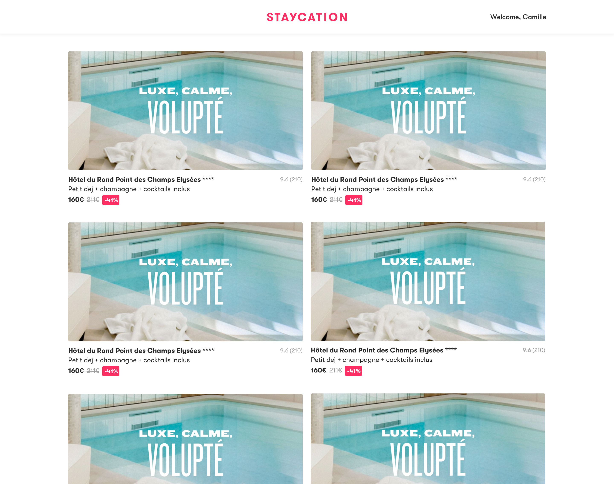

# Staycation's Technical Test

Welcome! This technical test aims to validate a few basic programming skills before we go further.

The goal is to reproduce a light version of Staycation's homepage package wall.
Some of the questions are independant, some others are sequentially dependant.

Remember that the goal is not necessarily to answer all the questions, but to go far enough to show the range of your talents ;)
Improvisation is welcome, as long as it demonstrates your ability to build great apps with us!

## Launch the apps
Before starting, check that you can run the following apps:

- The PostgreSQL database using `docker-compose up -V`
- The front app using `cd front; yarn start`
- The backend of your choice in the `back` folder, referring to its launch instruction

## Coding guidelines

### Do whatever you want with the code! 💪️
The code you just pulled is a minimal working frontend/backend app needed to answer the questions.
This is not required, but you can install any additional package you want and do whatever you want
with the code to show us your skills, as long as you answer the questions 😉️

### Styling
A few key points to help you through styling:
1. App must be browsable on any decent-size desktop screen
2. Paddings, margins & border radiuses have discrete values: 4px, 8px or any other multiple of 8
3. Color set is located [here](front/src/styles/colors.scss)


## Ready? GO! 🏁️

1. Fetch hotels so it matches the hotel model described below
2. Display hotel cards as shown in the figure below
3. Top bar should be static while scrolling. Implement it
4. We want the Staycation logo to be centered in the top bar, as shown in the figure below. Implement it.
5. Display the aggregated review count & score for each package card
6. Display the last availability on every package price. See availability definition below
7. Take bookings into account to compute remaining stock
8. If a package is not available on the current sale date, fetch its lowest opening price on the most recent sale date it has availabilites on (careful, it's a windowed lookup ;)). Display these availabilities in grey on the package card.
9. (no code) How would you implement a caching strategy for this app?

### Appendix

#### Expected hotel model
```json
{
    "id": 1,
    "name": "Molitor",
    "stars": 5,
    "preview": "Petit dej + piscine + ...",
    "pictureId": "",
    
}
```

#### Hotel card


#### Final expected result


#### Availability definition
- An hotel availabilities are defined by its rooms openings (easy)
- The table `openings` has 6 interesting columns: `room_id` (malin), `sale_id`, `date`, `stock`, `price` and `discount_price`
- An hotel is bookable on a given day only if there is at least an opening for one of its room on this date and with a stock > 0
- The lowest availability on a sale period for an hotel is the available opening with the lowest `discount_price` on this given `sale_id`
- The last `sale_id` for this test is (obviously) the `sale_dates` row where the date is the latest (`id 90` in our test data)
